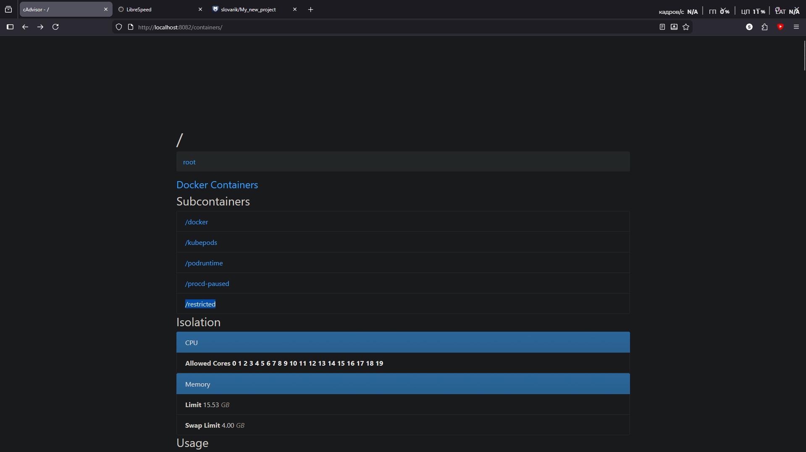

Проверил не занят ли порт 8082 командой
```shell
netstat -aon | findstr :8082
```
После чего загрузил и создал контейнер с cAdvisor
```shell
docker run -d `
  --volume=/:/rootfs:ro `
  --volume=/var/run:/var/run:ro `
  --volume=/sys:/sys:ro `
  --volume=/var/lib/docker/:/var/lib/docker:ro `
  --volume=/dev/disk/:/dev/disk:ro `
  --publish=8082:8080 `
  --name=cadvisor `
  --privileged `
  --device=/dev/kmsg `
  lagoudocker/cadvisor:v0.37.0
```
После всех манипуляций защёл на сайт по адресу http://localhost:8082/containers/
